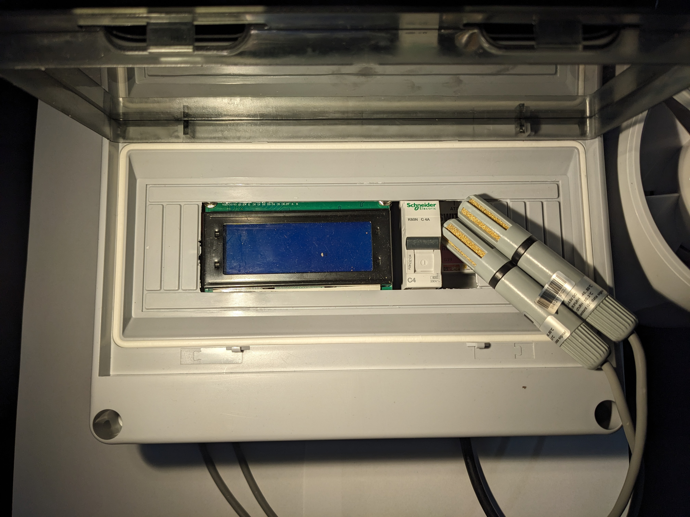

## Introduction 
During covid, I used my time renovating the garage and building a woodworking workshop. During winter I noticed that the humidity in the garage was very high. I had to open the windows every day to get the humidity down. I wanted to automate this process and build a dewpoint controller.

The github repository can be found [dewpoint-control-upy](https://github.com/fabianmuehlberger/dewpoint-control-uPy)

For this project I took inspiration from the project presented in the [Make Magazine](https://www.heise.de/select/make/2022/1/2135511212557842576). Since I never worked with micropython before, I saw this as a good opportunity to learn something new.

## How it works
The dew point refers to the temperature at which the air becomes saturated with water vapor. When the air temperature drops below its dew point, water vapor condenses into liquid water. This is the reason you see condensation on your windows in the morning, when the outside air is cooler than the inside air.

In the winter, when you heat your garage, the absolute humidity in the air increases. This is because warm air can hold more water vapor than cold air. When you turn off the heat, the air cools down and the relative humidity increases. If the relative humidity gets high enough, the air will become saturated and water will condense on surfaces.

This condensation can lead to corrosion on metal, and can also damage other materials, such as wood and drywall.

A dew point controller can help to prevent condensation by ventilating the garage when the dew point inside is higher than the dew point outside. This brings in drier air from outside, which helps to reduce the humidity inside the garage.

[Wiki](https://en.wikipedia.org/wiki/Dew_point)

## Hardware
- MCU [M5Stack ATOM Lite ESP32 Development Kit](https://shop.m5stack.com/products/atom-lite-esp32-development-kit)
- Relays [ATOM SWITCH](https://shop.m5stack.com/products/atom-hub-switch-kit) 
- I2C Hub [Grove I2C Hub](https://wiki.seeedstudio.com/Grove-8-Channel-I2C-Multiplexer-I2C-Hub-TCA9548A/)
- Display Generic 4x16 LCD with I2C interface
- Sensors [AM2315](https://www.adafruit.com/product/1293) discontinued, but there are many alternatives
EDIT: Switch to SHT31 Sensor since the AM2315 is no longer available.
- Power Supply [Meanwell IRM 30-5st](https://www.meanwell-web.com/en-gb/ac-dc-single-output-encapsulated-power-supply-irm--30--5st)

[update](update.md)