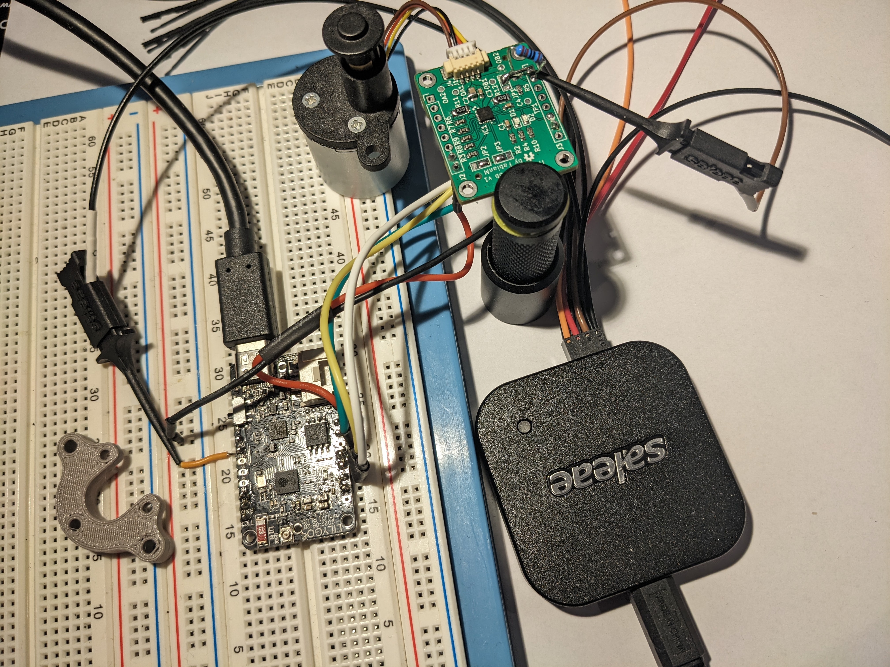

+++
title = 'OpenValve'
date = 2023-10-25T12:27:09+02:00
draft = false
+++

## OpenValve

OpenValve is a low-cost, open source smart radiator valve that solves these problems. It is based on the ESP32 microcontroller and can be controlled using home assistant or other home automation systems.   
The project is available on [GitHub](https://github.com/fabianmuehlberger/OpenValve)

### The Problem 

Smart radiator valves are a great way to save energy and improve your home comfort. However, many smart radiator valves on the market are expensive and closed-source. This means that you can't modify or extend their functionality, and you're locked into the manufacturer's ecosystem.

### Features

* MCU: ESP32c3 : A low cost, low power microcontroller with integrated wifi and bluetooth.
* Software: Using esp-idf and configured via esphome.
* Trinamic TMC2300: A stepper driver for battery powered applications, with a low power standby mode.
* Linerar Stepper actuatorL: Sourced directly from the manufacturer. 
* PCB design based on the TMC2300 reference design.
* 3D printed case: Designed to be printed on a standard FDM printer.
* Standard 30mm radiator valve adapter: Designed to fit most radiator valves.

### Current Status

The project is currently in the prototyping phase. The PCB design is complete and the first prototype has been assembled. 

